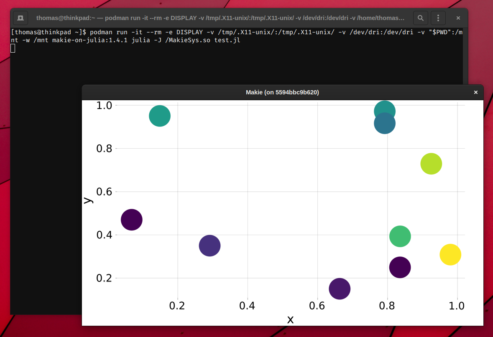

# Makie.jl on Julia OCI Image

Julia OCI image with precompiled Makie.jl on top of it.

*Didn't have the chance to test it with Docker's tools yet, only with buildah/podman.*

## Build image

*For docker, replace `buildah bud` by `docker build`.*

```
$ buildah bud -t makie-on-julia:1.4.1 .
```

This can take quite a while.

## Run

*For docker, replace `podman` by `docker`.*

### Option 1: Run a specific Julia script

```
$ podman run -it --rm -e DISPLAY -v /tmp/.X11-unix/:/tmp/.X11-unix/ -v /dev/dri:/dev/dri -v "$PWD":/mnt -w /mnt makie-on-julia:1.4.1 julia -J /MakieSys.so <script.jl>
```

#### Side note

No matter if you run a Julia script with a Makie.jl scene via `julia <script.jl>` natively or in a container,
you want the window to stay open after `display(scene)`.

I found a nice way on how to achieve that:
```
Observables.on(o -> if !o[] exit() end, scene.events.window_open)
display(scene)
readline()
```

* `readline()` makes sure the script doesn't exit immediately
* An additional listener keeps track of the window state. Once you close it, the program exits

### Option 2: Julia REPL

```
$ podman run -it --rm -e DISPLAY -v /tmp/.X11-unix/:/tmp/.X11-unix/ -v /dev/dri:/dev/dri -v "$PWD":/mnt -w /mnt makie-on-julia:1.4.1 julia -J /MakieSys.so
```

In your script, call `AbstractPlotting.__init__()` immediately after `using Makie`.

### Notes

* We mount `$PWD`, so we can access its files
* If you want the container to be kept, remove `--rm` and give it a `--name <container name>`

## Example

Script: `test.jl`:
```
using Makie
import Observables

x = rand(10)
y = rand(10)
colors = rand(10)
scene = scatter(x, y, color = colors)

Observables.on(o -> if !o[] exit() end, scene.events.window_open)
display(scene)
readline()
```

```
$ podman run -it --rm -e DISPLAY -v /tmp/.X11-unix/:/tmp/.X11-unix/ -v /dev/dri:/dev/dri -v "$PWD":/mnt -w /mnt makie-on-julia:1.4.1 julia -J /MakieSys.so test.jl
```

### Screenshot



## Links

* The Julia Language: https://julialang.org/
* Makie.jl: http://makie.juliaplots.org/